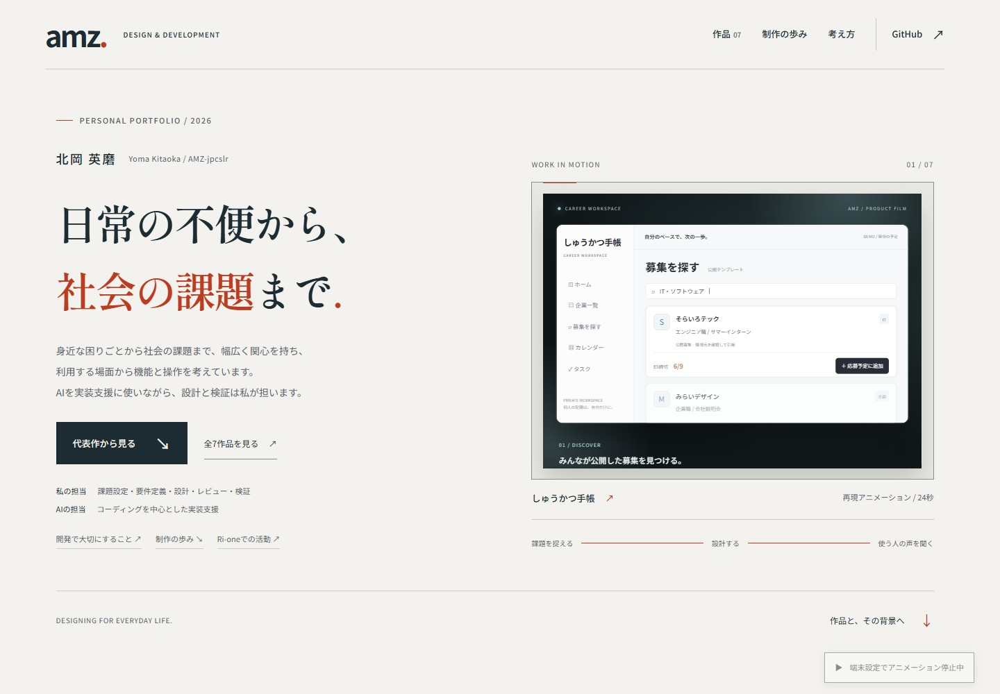
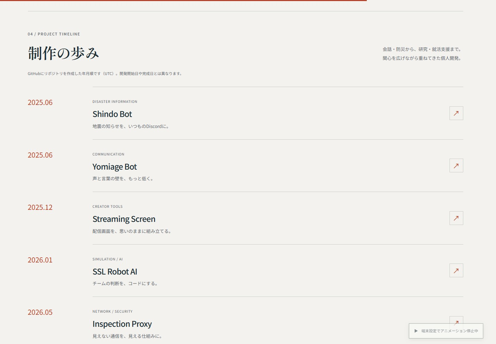
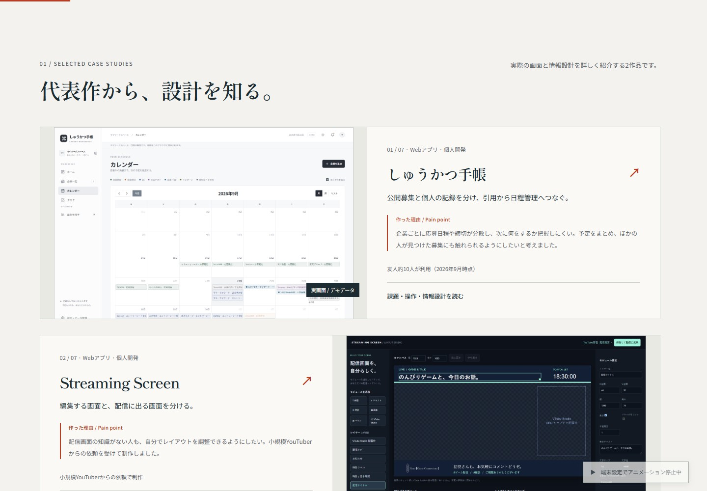
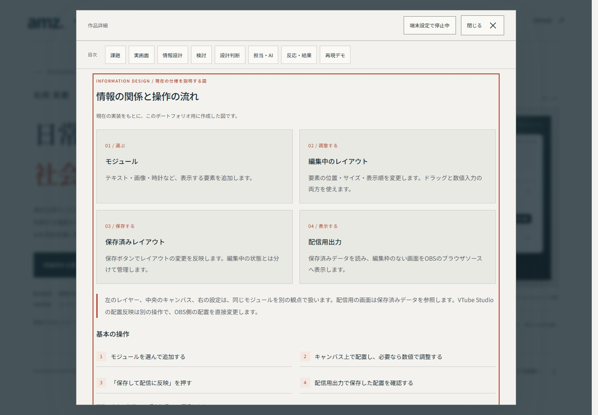
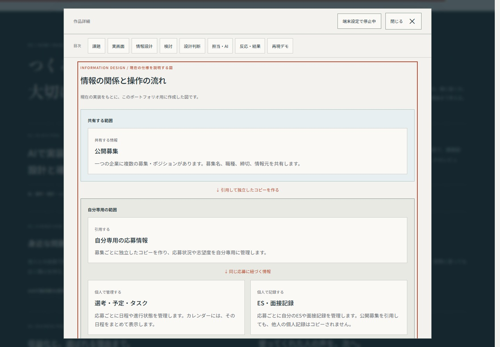
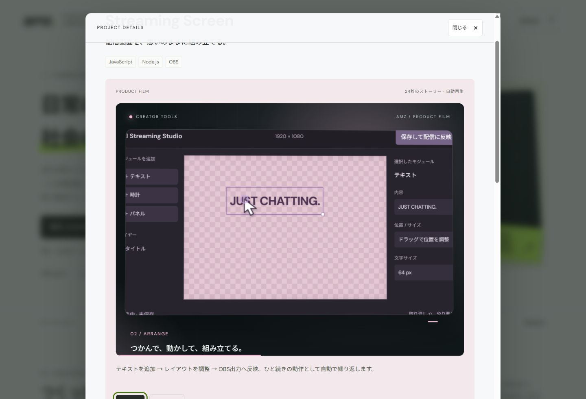
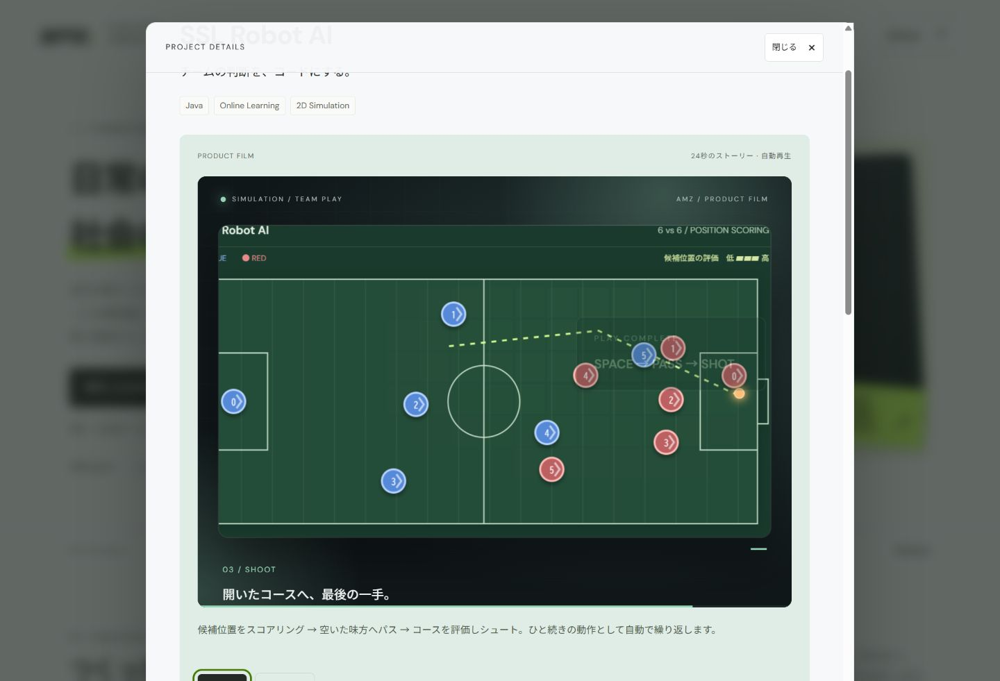
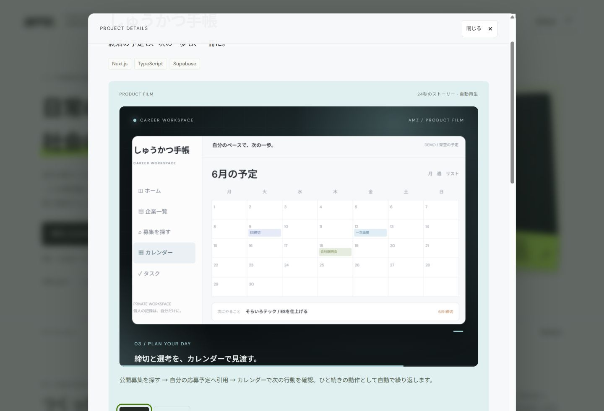

# Kitaoka Yoma / AMZ — Developer Portfolio

**日常の不便から、社会の課題まで。個人開発から、問題解決の糸口をつくる。**

[公開サイトを見る](https://portfolio-amz-jpcslr.vercel.app/) · [制作一覧](https://portfolio-amz-jpcslr.vercel.app/#work) · [GitHub](https://github.com/AMZ-jpcslr)

北岡英磨（Yoma Kitaoka / GitHub: AMZ-jpcslr）の7つの個人開発について、動作デモに加え、**課題設定・検討プロセス・意思決定の理由・担当範囲・AIの活用方法・利用者に届いた価値**を紹介するポートフォリオです。



## 制作体制とAIの活用

掲載作品は個人開発です。**コーディングに生成AIを大きく活用**しています。私は課題設定・要件定義・機能・仕様・構成の設計に加え、評価設計、生成コードのレビュー、デバッグ・修正・テスト、実行結果の確認を担当します。開発全体で行っていることと、各作品で担当したことを紹介します。

| 担当 | 内容 |
| --- | --- |
| 私 | 課題設定、要件定義、機能・仕様・構成の設計、評価設計、生成コードのレビュー、デバッグ・修正・テスト、実行結果の確認 |
| AI | コーディングを中心とした実装支援 |
| 利用者・依頼者 | 実際の利用や依頼を通じた関わり。共同開発者とは区別して記載 |

SSLの試作は、私が所属する立命館大学Ri-oneのSSLチームで活用されました。ここでは個人制作したプロトタイプの貢献範囲を示し、チーム全体の成果と区別しています。

## 開発で大切にしていること

- **AIは時短のためのツール**：コーディングを中心にAIを活用し、設計・生成コードのレビュー・修正・テスト・実行結果の確認を私が担います。
- **身近な問題から社会問題まで**：分野を限定せず、広い視野と個人の実践から解決の糸口を探します。
- **本当に必要とされ、使われるか**：完成だけをゴールにせず、誰のどんな困りごとに役立つのかを考えます。
- **ビジネスとしての視点**：事業化しない場合も、マネタイズや競合優位性、継続して価値を届ける方法まで考えます。
- **ユーザーフィードバック**：便利な点も使いにくい点も受け止め、次の判断や改善につなげることを大切にします。

## 制作の歩み

[サイトの制作年表](https://portfolio-amz-jpcslr.vercel.app/#timeline)は、GitHub APIの `created_at` を基準に古い順で表示します。年月はUTCです。開発開始日・完成日・製品の公開日を示すものではありません。同月の作品も正確なタイムスタンプで並べています。

| リポジトリ作成年月（UTC） | プロジェクト |
| --- | --- |
| 2025.06 | [Shindo Bot](https://github.com/AMZ-jpcslr/Shindo_Discord_Bot) |
| 2025.06 | [Yomiage Bot](https://github.com/AMZ-jpcslr/Yomiage_Discord_Bot) |
| 2025.12 | [Streaming Screen](https://github.com/AMZ-jpcslr/Streaming-Screen) |
| 2026.01 | [SSL Robot AI](https://github.com/AMZ-jpcslr/SSL-DEMO) |
| 2026.05 | [Inspection Proxy](https://github.com/AMZ-jpcslr/ssl-inspection-prodxy) |
| 2026.09 | [Artificial Moral Architecture](https://github.com/AMZ-jpcslr/Artificial-Moral-Architecture) |
| 2026.09 | [しゅうかつ手帳](https://github.com/AMZ-jpcslr/Syukatu-Note) |



表示名は[GitHubプロフィール](https://github.com/AMZ-jpcslr)、作成日時は[公開リポジトリAPI](https://api.github.com/users/AMZ-jpcslr/repos?per_page=100)で2026-09-29に確認しています。

## 完成までの考え方を読む



トップから**しゅうかつ手帳とStreaming Screen**を代表作として開けます。7作品はすべて残し、一覧の先頭にも代表作を置いています。既存の `#project=リポジトリ名` の直接リンクは維持しています。

詳細は課題から読み始め、代表作には実画面と情報の関係図を追加しました。追従する目次で「課題」「実画面」「情報設計」「検討」「設計判断」「担当・AI」「反応・結果」「再現デモ」へ移動できます。再現アニメーションは詳細の後半にあり、実アプリの録画とは明確に区別しています。

- **私の経験**：担当したこと、利用者から聞いた感想、引用機能の追加時に気づいた問題。
- **現在の仕様**：公開募集と個人コピー、通常のレイアウト保存と出力反映の関係。ソースコードへのリンクを併記。
- **今回作成した説明図**：現在の情報構造・操作を整理したもの。開発当時の資料ではありません。
- **今後の検証案**：利用者の反応から言える範囲と、次に確かめたい操作。測定済みの成果として扱いません。

Ri-oneの戦略班での活動、10年間のゴールキーパー経験、Javaの使用は、SSL Robot AIの個人試作と分けて説明しています。



利用状況や担当したこと、AIとの分担は、私の経験に基づいて記載しています。設計の説明は現在の仕様をもとに整理し、開発当時の資料や実施済みの検証と区別しています。

## 掲載プロジェクト

作品一覧と代表作のカードには「作った理由 / Pain point」を掲載し、解決したかった困りごとから利用者の反応へ読み進められるようにしています。文章は `dist/projects.js` の `painPoint` で編集できます。

| プロジェクト | 課題と設計上の判断 | 利用・活用先 |
| --- | --- | --- |
| [しゅうかつ手帳](https://github.com/AMZ-jpcslr/Syukatu-Note) | 就活の日程管理と公開募集の引用。共有情報と個人の記録を分離 | 友人約10人（2026年9月時点）。予定を整理しやすく、ほかの人が見つけた応募機会に触れられる点が好評 |
| [Streaming Screen](https://github.com/AMZ-jpcslr/Streaming-Screen) | 配信画面を直感的に編集。編集と出力を分け、保存時に配信へ反映 | 小規模YouTuberからの依頼。専門知識なしで操作できる点が好評 |
| [Yomiage Bot](https://github.com/AMZ-jpcslr/Yomiage_Discord_Bot) | 声を出せない人の会話参加を支援。読み上げと翻訳を分離し、会話の継続を重視 | 友人約10人。テキストだけでボイスチャットへ参加できる点が好評 |
| [Shindo Bot](https://github.com/AMZ-jpcslr/Shindo_Discord_Bot) | PC作業中に地震速報へ気づけるよう、Discordへ通知。震度条件と重複判定を設計 | 友人約10人。普段開いているDiscordで速報を受け取れる |
| [Artificial Moral Architecture](https://github.com/AMZ-jpcslr/Artificial-Moral-Architecture) | 行動の未来と当事者への影響を評価。判断と実行を独立した段階に分離 | 個人研究。既存AIモデルへの活用を今後探究 |
| [Inspection Proxy](https://github.com/AMZ-jpcslr/ssl-inspection-prodxy) | 見えない通信を可視化。中継・検出・記録・表示を分離 | 母と営む小規模な会社。監視とネットリテラシー向上に活用 |
| [SSL Robot AI](https://github.com/AMZ-jpcslr/SSL-DEMO) | 位置取りの候補をマップ上でスコアリング。パス・シュート判断につなげる | 立命館大学Ri-oneのSSLチームへ導入するシステムのプロトタイプ |

## 代表作の実画面

代表作の詳細には、各製品のREADME用撮影で作られた実画面を掲載しています。しゅうかつ手帳はローカルのデモ環境で、実在する企業名をサンプルに使い、日程・応募状況は架空です。Streaming Screenは一時データ領域に作った検証用レイアウトで、OBSには接続していません。個人の非公開応募記録や依頼者の実配信画面ではありません。



実画面の出典・確認した実装は [素材と記述の根拠](docs/portfolio-evidence.md) にまとめています。PNGは `dist/assets/` に保存し、寸法指定・遅延読み込みで表示します。画像を選ぶと元の大きさで開けます。

## デモのスクリーンショット

以下は**このポートフォリオ内で動く機能再現デモを、ブラウザで撮影した画像**です。元の製品やDiscord・OBSの実稼働画面のキャプチャではありません。実装や公開仕様に沿って、操作と処理の流れを説明するために再構成しています。

### 配信画面の編集

テキストを追加し、カーソルと一緒にドラッグして配置を調整。保存すると配信用の表示へ反映する流れです。



### ロボットサッカーの位置評価

6対6の配置から候補位置を評価し、移動・パス・シュートへつなげる模式デモです。



7作品すべてに、作品別の導入コピー・奥行きのあるカメラ移動・操作に同期した字幕・利用価値を伝えるエンドカードを用意しています。

各デモは24秒で自動再生・ループし、一時停止・再開、最初からの再生、再生位置の移動ができます。映像はブラウザ内のHTML / CSSで描画する無音のアニメーションで、MP4ファイルではありません。Discord送信、音声合成、外部APIへの接続、実際の通信検査、Java / Pythonの実行は行いません。地震情報・通信ログ・位置評価の色は説明用サンプルです。

### しゅうかつ手帳

公開募集を見つけ、自分専用のコピーとして引用し、カレンダーで次の予定を確認します。友人約10人（2026年9月時点）が利用し、予定の管理しやすさと、ほかの人が見つけた応募先に触れられる点が好評です。



[しゅうかつ手帳を開く](https://syukatu-note.vercel.app/) · [公開リポジトリ](https://github.com/AMZ-jpcslr/Syukatu-Note)

## ローカルで動かす

Node.js 22以上を使用します。外部npmパッケージのインストールは不要です。

```sh
npm run dev
# npmがない場合
node scripts/serve.mjs
```

`http://127.0.0.1:4173` を開きます。ファイルを編集したらブラウザを再読み込みしてください。ポートは `PORT` 環境変数で変更できます。ES Modulesを使うため、HTMLファイルのダブルクリックではなくHTTPサーバー経由で表示します。

```sh
npm run check  # データ・アセット・JavaScript構文などを検証
npm run build  # 公開URLをOGPへ反映してから検証
# npmがない場合
node scripts/check.mjs
node scripts/build.mjs
```

`dist/` は編集するソース兼公開フォルダです。ビルドで生成し直すフォルダではないため、削除しないでください。

## 紹介内容を更新する

`dist/projects.js` がプロジェクト情報の元データです。配列の順が表示順になり、通し番号は自動で付けます。代表作・一覧・詳細は同じ番号を使い、制作年表のみ作成日時順に並べます。`featured: true` の作品を代表作として紹介します。

| 項目 | 内容 |
| --- | --- |
| `repositoryCreatedAt` | GitHub APIの `created_at`（UTCのISO日時）。年表の順序と年月に使用 |
| `summary` / `challenge` | 一覧の概要 / 解決したい課題 |
| `caseStudy.focus` | 設計の焦点。一覧と詳細冒頭に表示 |
| `caseStudy.process` | 課題から機能・実装へ至る説明。`title` と `body` の配列 |
| `caseStudy.decision` | `choice`：設計判断、`reason`：理由、`tradeoff`：制約 |
| `caseStudy.role` | `scope`：私の担当、`collaboration`：利用者・依頼者・チームとの関係 |
| `caseStudy.ai` | `human`：私が担当したこと、`assistant`：AIが担当したこと |
| `engineering` / `features` | 実装の構成 / 主な機能 |
| `audience` / `impact` | 利用者 / 利用者に届いた価値 |
| `outlook` | 研究などの今後の展望 |

新しい判断経緯、使用したAIツール、検証手順を追加するときは、実際に確認できた内容を記入してください。画像は `docs/images/` に保存し、READMEから相対パスで参照します。画像の更新方法は [キャプチャの記録](docs/images/README.md) を参照してください。

## ページ全体のモーションデザイン

PVとページの動きを揃え、淡いペーパー色・セージグリーン・ライムの配色に刷新しました。

- **トップ**：2行の見出しがマスクから現れ、キーワードの下線と説明が順に登場。背景の軌道とスクロールに連動する小さな奥行きで、デモを引き立てます。
- **作品一覧**：大きなタイポグラフィ、同じ行の上下端と高さを揃えたカード、画面に入ったときの登場演出。マウスを動かすとカード上の光が控えめに追従します。カードの外枠は動かさず、グリッドの整列を保ちます。
- **開発姿勢・結び**：線が伸びる5つの開発方針と、軌道のモチーフを再び使ったクロージング。詳細のケーススタディにも登場演出があります。
- **操作**：ページ上部の読了プログレス、表示位置に応じたナビゲーション、ボタンの色と矢印の動き、詳細画面の登場演出。

画面右下と詳細画面上部の停止ボタンは、ページ演出とPVの両方に適用されます。停止状態で詳細を開いた場合は、操作場面の静止画を表示します。OSの「視差効果を減らす」設定にも対応し、停止時はすべての本文を表示します。スマートフォンではスクロールによる奥行きを抑えます。通常のスクロール操作は変更していません。

背景の軌道は画面外・非表示タブ・詳細表示中に停止します。ページ側のJavaScriptは入力があったときだけ描画を予約し、スクロール演出のために常時ループしません。

## スマートフォンでの描画負荷を抑える仕組み

- PVの領域は先に確保し、画面の約180px手前に来てから内部のUIを組み立てます。初期表示で全8本のPVを一括生成せず、表示中の映像だけを再生します。
- 画面外のPVは再生を止め、ブラウザにも内部の描画を省略できるよう指定します。戻ってきたPVは停止した位置から再開します。
- モバイル幅・タッチ操作の端末では、3Dの傾き・動くぼかし・装飾の影を減らします。Botの発話表示やサッカーなど、機能を伝える動作と24秒の流れは維持します。
- 再生時間・シークバーの表示更新は毎秒10回に制限。PV自体はCSSで滑らかに再生し、停止・閉じた後には表示更新も止めます。
- スクロール時にページ全体の高さを毎回測り直さず、レイアウト変更時に更新します。
- WebフォントをCSS内の後続読み込みからHTMLでの並行読み込みへ変更。接続を先行し、遅い回線ではフォントを後から差し替えずシステムフォントで表示します。

実際の滑らかさは端末・ブラウザ・省電力設定にも左右されます。画面幅を変えたブラウザ確認は、実機のフレームレート測定の代わりにはなりません。

## サイトの動作

- 一覧からネイティブのモーダルダイアログで詳細を表示。Esc・閉じるボタン・背景クリックで閉じます。
- `/#project=Streaming-Screen` のようなURLで詳細を直接開けます。
- CSSの同一時間軸でカメラや登場要素を動かし、一時停止した位置から再開します。
- 画面外のカード、詳細表示中の背景、非表示タブのデモは一時停止します。
- サイト全体のアニメーション停止とOSの `prefers-reduced-motion` に対応。説明文は停止中も読めます。
- スマートフォンでは1列、デスクトップでは2列のカード表示。検討プロセスや担当情報も画面幅に合わせて折り返します。
- GitHub APIを閲覧時に呼び出さず、Google Fontsが使えない場合はシステムフォントへ切り替えます。

## Vercelへの公開・共有画像

[公開サイト](https://portfolio-amz-jpcslr.vercel.app/)へ変更を反映するには、接続したGitHubリポジトリへ変更を反映し、Vercelで再デプロイします。

| 設定 | 値 |
| --- | --- |
| Framework Preset | Other |
| Root Directory | リポジトリ直下 |
| Build Command | `npm run build` |
| Output Directory | `dist` |

`vercel.json` に公開設定を用意しています。通常はAPIキーや追加環境変数は不要です。

`dist/og-image.png`（1200 × 630 px）をOGP・X向けの画像に設定しています。メタ情報は初期HTMLに含まれます。公開URLの優先順位は `SITE_URL` → `VERCEL_PROJECT_PRODUCTION_URL` → `VERCEL_URL` → 現在の公開URLです。独自ドメインを使う場合は `SITE_URL` を設定してください。

PNGはリポジトリに含まれ、Vercelでの画像生成やPythonのインストールは不要です。共有画像を作り直す場合だけ、PillowとWindowsのArial / 游ゴシックがある環境で `python scripts/create-social-image.py` を実行します。

## ファイル構成

```text
dist/
  index.html          トップページ・ダイアログ・OGP
  projects.js         作品情報・ケーススタディの元データ
  case-study.js       検討プロセス・担当・AI分担の表示
  product-evidence.js  代表作・実画面・関係図・Ri-oneの活動
  case-evidence.css   上記のレスポンシブ表示
  assets/             デモ環境の実画面PNG
  app.js              一覧・詳細・デモ制御
  styles.css          基本レイアウトとケーススタディ
  design-system.css   全ページ共通の配置・文字・配色
  fonts.css / assets/fonts/ ローカルのWOFF2とフォントライセンス
  page-motion.js / page-motion.css 登場演出・停止制御
  demos.js / demos.css 機能再現デモとCSSアニメーション
  films.js / films.css 7作品の構成・字幕・カメラ・映像演出
  og-image.png        リンク共有用サムネイル
docs/images/          READMEに掲載するブラウザキャプチャ
scripts/
  serve.mjs           ローカルプレビュー
  build.mjs           OGP公開URLの反映と検証
  check.mjs           データ・構文・アセットのチェック
  create-social-image.py 共有画像の再生成（任意）
vercel.json           Vercel公開設定
```

## 情報の出典

公開リポジトリのREADME・仕様と私の経験をもとに、このサイト自体を除く7作品を掲載しています。利用状況は2026年9月時点のものです。担当範囲・AIの活用方法は2026年9月29日に更新しました。リポジトリとの自動同期は行っていません。

- [Yomiage BotのREADME](https://github.com/AMZ-jpcslr/Yomiage_Discord_Bot/blob/master/README.md)
- [Shindo BotのREADME](https://github.com/AMZ-jpcslr/Shindo_Discord_Bot/blob/master/README.md)
- [Streaming ScreenのREADME](https://github.com/AMZ-jpcslr/Streaming-Screen/blob/master/README.md)
- [Artificial Moral ArchitectureのREADME](https://github.com/AMZ-jpcslr/Artificial-Moral-Architecture/blob/master/README.md)
- [Inspection ProxyのREADME](https://github.com/AMZ-jpcslr/ssl-inspection-prodxy/blob/main/README.md)
- [SSL Robot AIのREADME](https://github.com/AMZ-jpcslr/SSL-DEMO/blob/master/ssl-robot-ai/README.md)
- [しゅうかつ手帳のREADME](https://github.com/AMZ-jpcslr/Syukatu-Note/blob/master/README.md)（2026-09-27確認）
- [Vercelの公開設定](https://vercel.com/docs/project-configuration) / [公開URL環境変数](https://vercel.com/docs/environment-variables/system-environment-variables#vercel_project_production_url) / [Open Graph](https://ogp.me/)

## 公開前の改善プロトタイプ

2026年10月6日の全体レビューでは、一覧の重複する説明、文字サイズ、詳細の目次、停止時の状態表示、詳細を連続して開閉した際のリンク処理を見直しました。[レビュー記録](docs/site-review-2026-10-06.md)に問題と対応をまとめています。

変更前のローカル保存が `.review/before/` にある環境では、以下で比較ページを開けます。`.review/` は公開対象・Git管理から除外しています。

```sh
node scripts/review-preview.mjs
```

`http://127.0.0.1:4175/` に比較ページ、`/after/` に改善案、`/before/` に変更前を表示します。通常のプレビューは従来どおり `node scripts/serve.mjs` です。

## 2026年10月9日のデザイン刷新

frontend-designスキルを使い、明朝体の見出しとゴシック体の本文、インク色と朱色、細い罫線を軸に配置・文字・配色を刷新しました。代表作は横長に配置し、全7作品のPain point・担当・利用状況と、作品ごとの再現アニメーションは維持しています。READMEの主要な画面キャプチャも更新しました。

[デザインレビューと確認結果](docs/design-review-2026-10-09.md)に、変更理由・配色・フォント・動きの方針をまとめています。通常のプレビューは `npm run dev`、今回の改善前後の比較は同記録の手順で起動できます。
