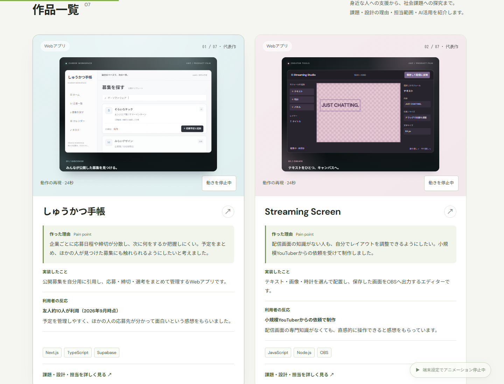
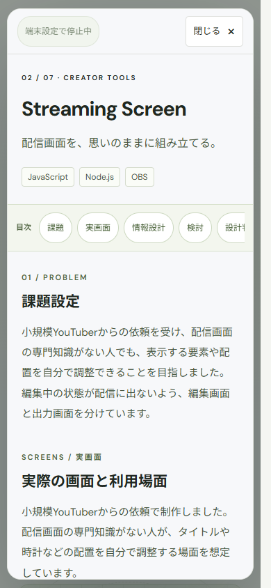

# ポートフォリオ全体レビュー・改善案

2026年10月6日。公開前のローカルプロトタイプです。Vercelへのデプロイは行っていません。

## 確認範囲

トップページ、代表作、全7作品の一覧と詳細、制作の歩み、Ri-oneでの活動、考え方を確認しました。文章と構成に加え、実画面・情報構造の図・再現アニメーションの区別、画面幅ごとの表示、主要な操作とリンクも確認しています。既存の作品・URL・利用状況は維持しています。

## 確認した問題と対応

| 問題 | 実装した改善 |
| --- | --- |
| 一覧で概要・制作のきっかけ・設計の焦点が重なり、読む順序が分かりにくい | 「作った理由 → 実装したこと → 利用者の反応」の順に統一しました。詳しい設計の説明は詳細にまとめています。個人研究では「研究の現在地」と表記しています。 |
| 小さい文字や薄い文字、英語を優先した見出しがある | 本文・ラベルのサイズと文字色を調整し、ページの移動先は日本語で示しました。大きな装飾見出しの重複も減らしています。 |
| 説明が体言止めや断片的な文になり、文体が揃っていない | 説明文をです・ます調に整えました。キュー、Dry Run、スコアリングには短い説明を添えています。 |
| 詳細の目次に課題・設計判断・結果がなく、長いページで戻りにくい | 作品名の直下に追従する目次を置きました。各項目へ移動すると見出しにフォーカスし、固定部分に隠れない位置で表示します。 |
| 担当・AIの説明が課題より先に繰り返される | 詳細は課題から読み始め、制作体制と担当の説明は「担当範囲」の場所に集約しました。開発全体の役割と作品ごとの確認済みの担当範囲は区別しています。 |
| 個人研究について、実装で確認できる範囲と現実への適用範囲が読み取りにくい | 研究用のルールによる試作であることを明確にし、現実の倫理的妥当性・安全性は未検証であると説明しています。 |
| 動きを減らす設定でStreaming Screenの「編集中」と「保存済み」が重なる | 停止画面で状態表示が重ならないようにし、カーソルなどの移動を表す要素も整理しました。 |
| 詳細を閉じてすぐ次の直接リンクを開くと、前の終了処理が新しいURLを消す場合がある | 新しく開いた詳細を古い終了処理が変更しないよう修正しました。連続して開閉する操作でも、表示作品とURLが一致します。 |

## プレビュー

- [改善前後の比較ページ](http://127.0.0.1:4175/)
- [改善案の作品一覧](http://127.0.0.1:4175/after/#work)
- [しゅうかつ手帳の詳細](http://127.0.0.1:4175/after/#project=Syukatu-Note)

比較ページは `node scripts/review-preview.mjs` で起動します。変更前の保存と比較ページの素材は `.review/` に置き、Git管理と公開対象から除外しています。通常のプレビューは `node scripts/serve.mjs` で起動できます。

### PCの作品一覧

### スマートフォンの作品詳細

## 確認結果

- ビルドと既存のデータ・構文・画像・リンク構成のチェックを実施しました。
- Microsoft Edgeのヘッドレスブラウザで、1440・1024・768・760・390・320pxの6種類の画面幅を確認しました。全7作品の一覧・詳細に横へのはみ出しはなく、2列表示ではカードの上端と高さが揃っています。760px以下は1列表示です。
- 全7作品の直接リンク、詳細の開閉、全目次の移動先・フォーカス、Escapeキーでの終了、実画面画像の読み込みを確認しました。連続した開閉でURLが失われる問題の修正も確認しました。
- 自動再生、一時停止・再開、再生位置の変更、全体のアニメーション停止、OSの「動きを減らす」設定での静止表示を確認しました。
- 調べた主要本文・目次など90件の文字色は、背景とのコントラスト比が最小5.84:1でした。サイト全体のアクセシビリティ適合認証を意味するものではありません。
- GitHub、公開アプリ、出典など外部リンク16件がHTTP 200を返すことを確認しました。ブラウザ実行エラーは発生していません。

これらは今回のポートフォリオの表示・操作確認です。各制作物について、利用者への正式なインタビューやユーザビリティテストを実施したことを示すものではありません。

## 追加の事実があると充実する箇所

- しゅうかつ手帳の引用機能で、同じ企業の複数ポジションをすべて／一部引用できなかった問題について、修正後の仕様、使用AI、修正と確認の方法が分かると、設計から検証までを具体的に紹介できます。
- Ri-oneで相談・分担した相手、提案したゴールキーパー戦略、検証方法と結果、個人の試作との直接の関係が分かると、協働の内容をより具体的に紹介できます。

今回は確認済みの情報だけで構成しています。未提供の判断・測定値・協働の実績は補っていません。
